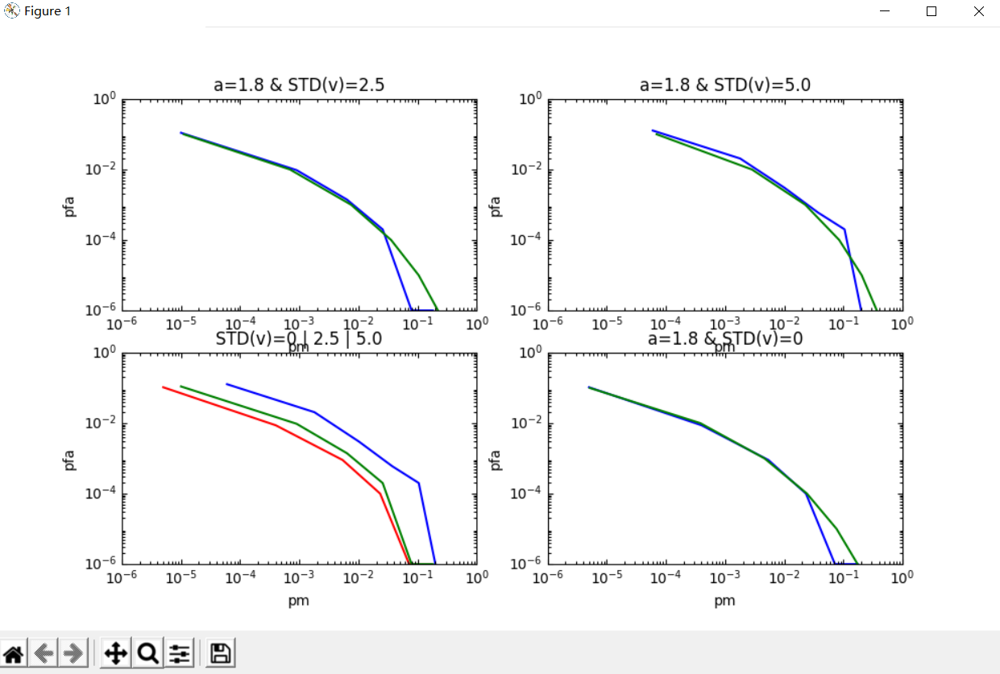
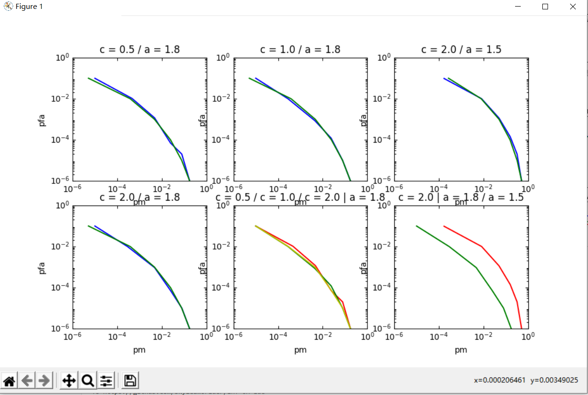

# MonteCarlo 仿真

实际上也是一次课后作业。

程序设计得比较乱套，毫无面向对象精神，有的只是面向 `ddl` 肝码时的慌张。

## 使用方式

没有什么写 `Makefile` 的必要了。
因为没有什么时间改 `main.cpp`，使用者也因此可以自行修改，使输出符合自己的期望。

需要注意的是，由于程序中目前所有的输出文件都输出到 `data` 这个文件夹里，因此需要在运行可执行程序之前，自行创建上一级目录下的 `data` 文件夹。

当然，这个也是可以自行修改的。

生成的数据包括：

* 无攻击状况下
  * c = 0.5 / a = 1.8 下的错检率、误检率；
  * c = 1.0 / a = 1.8 下的错检率、误检率；
  * c = 2.0 / a = 1.8 下的错检率、误检率；
  * c = 2.0 / a = 1.5 下的错检率、误检率；
* 攻击状况下
  * a = 1.8 / v = 0 下的错检率、误检率；
  * a = 1.8 / v = 2.5 下的错检率、误检率；
  * a = 1.8 / v = 5.0 下的错检率、误检率。

目前的 `data` 文件夹中是循环次数 100000 次的数据。

在使用 `requirements.txt` 安装后，可以使用 `script` 文件夹中给出的脚本文件绘图。

但是由于输出文件格式没有很好的规定，因此不好用 `python` 处理，绘图数据都是硬编码到程序里面的：

## 本次作业感想

这个部分完成程度大概在 85% 左右，并不算完美，甚至算不上优秀。

看来事情太多有时候也不是件好事。
