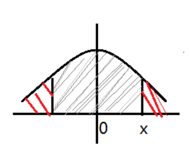

# 实验二 MonteCarlo 仿真

## 一、实验要求

### 1. 无攻击情况

给出一个 `STD = 10 / mean = 0` 的 `GGD` 分布，宿主信号服从该分布，此后观察嵌入强度 `a = 1.8`，样本容量为 1000 下的 `ROC` 曲线。

### 2. 受攻击情况

给出一个 `STD = 10 / mean = 0` 的 `Gauss` 分布，宿主信号服从该分布，此后观察嵌入强度 `a = 1.8`、高斯噪声 `STD = 2.5, 5`，样本容量为 1000 下的 `ROC` 曲线。

### 3. 通用要求

* 编程语言使用 `C++ / C`，不能使用脚本语言（画图时除外）；
* 代码简洁、逻辑清晰、运行正确、留有注释。

## 二、实验背景

### 1. GGD 分布

有关给定形状参数的 `GGD` 分布，我们组在上一次作业中就进行了实现，并且可以根据任意的形状参数、尺度参数得到分布。

但由于本题仅仅给定了 `STD`，没有给出尺度参数与 `STD` 换算的公式，一开始着实为我们的编码推进带来了一些困难。

之后这个公式是从 `fundamental-ppt` 的第 29 页找到，可谓是踏破铁鞋无觅处：

$$
\beta = \dfrac{1}{\sigma_X} (\dfrac{\Gamma(3/c)}{\Gamma(1/c)})^{1/2}
$$

由于公式是比较靠后才找到的，因此一开始参考了一些有关 `GGD c = 2.0, c = 1.0, c = 0.5` 实现的 `OpenSource`。但很可惜，网络空间中的代码质量参差不齐，要想做完作业，还得靠课件和自己。

### 2. ierfc 函数

入手该函数应该从它的反函数 `erfc` 来看：[1]



红色的表示它的值，也正式因此，一开始我鲁莽地以为 `erfc` 和 `Q` 函数相差的只是一个 **二倍关系**，这导致我难以得出正确的结果：

$$
erfc(x) = \dfrac{2}{\sqrt{\pi}} \int_x^{+\infty} \exp(-t^2) dt
$$

$$
Q(x) = \int_x^{+\infty} \dfrac{1}{\sqrt{2\pi}}  \exp(\dfrac{-t^2}{2}) dt
$$

但其实：

$$
Q(x) = \dfrac{1}{2}erfc(\dfrac{x}{\sqrt{2}})
$$

继而可以推得：

$$
iQ(x) = \sqrt{2}\ ierfc(2x)
$$

### 3. 转换关系

这个非常重要：**我们是人为设定 pfa 的**。

1. 设定 pfa
2. 得到 pfa 对应的理论阈值 psi
3. 得到 pfa 对应的理论 pm
4. 进行实验，得到实验 pm 和 pfa
5. 然后画 ROC 图进行比较

这样一个大的流程是必须清晰的，不然实现了小的功能后，无法统合所有已实现函数，更无法完成作业。

## 三、实验过程

## 1. MonteCarlo 类的确立

由于实验中需要存储一部分的变量，比如 `X`, `S_H0`, `S_H1`, `L(S0)`, `L(S1)` 等等，为了方便 `debug` 我都设成 `public` 成员了，此外还有一系列课件上的函数。

```c++
class MonteCarlo {
public:
    static const std::array<int, 2> w;

    std::vector<double> X;
    std::vector<double> S_H0;
    std::vector<double> S_H1;

    size_t N;

    double L_S_H0;
    double L_S_H1;

    /* some code */
}
```

## 2. 无攻击情况下的处理

首先需要人为设定理论误检率：

```c++
const std::vector<double> pfa_theory_arr {
    1e-6, 1e-5, 1e-4, 1e-3, 1e-2, 1e-1
};
```

之后计算 理论 pfa 和 理论阈值：

```c++
std::vector<double> psi_theory_arr;
std::vector<double> pm_theory_arr;
for (const double& pfa_theory : pfa_theory_arr) {
    // 根据理论 sigma 和理论 pfa 计算理论阈值
    psi_theory_arr.push_back(MC::calcuPsiTheory(STD, pfa_theory, N));
    // 计算理论漏检率
    pm_theory_arr.push_back(MC::calcuPmTheory(pfa_theory, N, a, STD));
}
```

仿真需要一个计数器，以此来计算某一条件下满足条件的个数，这样才能够得到最后的 “率”：

```c++
std::vector<double> experiment_pm_dot;
std::vector<double> experiment_pfa_dot;

/* some code */

size_t pm_cnt = 0;
size_t pfa_cnt = 0;

/* some code */

const size_t iter_num = 100000;
experiment_pm_dot.push_back(pm_cnt / static_cast<double>(iter_num));
experiment_pfa_dot.push_back(pfa_cnt / static_cast<double>(iter_num));
```

这里使用 GGD 分布生成一个数组，根据给定的嵌入强度，得到 `S_H0`, `S_H1`，并计算出线性相关器的值：

```c++
std::vector<double> X_MtClo { func(N) };

// 初始化 MonteCarlo 对象
MC::MonteCarlo MtClo(X_MtClo);
MtClo.imbed(a);
MtClo.genLinearCorrelator();
```

根据线性相关器，对是否满足条件进行判断：

```c++
pm_cnt += MtClo.isMiss(psi_theory_arr[i]);
pfa_cnt += MtClo.isFalseAlarm(psi_theory_arr[i]);
```

最后附上这段过程的总代码：

```c++
void lab_2_2_1(
    std::vector<double>(*func)(const double size),
    std::ostream& out,
    double a=1.8,
    size_t iter_num=100000,
    double STD=10.0,
    size_t N=1000
) {

    // 理论误检率
    const std::vector<double> pfa_theory_arr {
        1e-6, 1e-5, 1e-4, 1e-3, 1e-2, 1e-1
    };

    std::vector<double> psi_theory_arr;
    std::vector<double> pm_theory_arr;
    for (const double& pfa_theory : pfa_theory_arr) {
        // 根据理论 sigma 和理论 pfa 计算理论阈值
        psi_theory_arr.push_back(MC::calcuPsiTheory(STD, pfa_theory, N));
        // 计算理论漏检率
        pm_theory_arr.push_back(MC::calcuPmTheory(pfa_theory, N, a, STD));
    }

    // 嵌入强度 a = 1.8
    std::vector<double> experiment_pm_dot;
    std::vector<double> experiment_pfa_dot;
    // 7 个太慢了，现在只是 6 个
    for (size_t i = 0; i < pfa_theory_arr.size(); i++) {
        size_t pm_cnt = 0;
        size_t pfa_cnt = 0;

        // test_cnt < 1e6，因为题目要求误差在 1e-6 以下
        // 但是 1e6 太慢了
        for (size_t j = 0; j < iter_num; j++) {
            std::vector<double> X_MtClo { func(N) };

            // 初始化 MonteCarlo 对象
            MC::MonteCarlo MtClo(X_MtClo);
            MtClo.imbed(a);
            MtClo.genLinearCorrelator();

            // 根据实验值进行检验
            pm_cnt += MtClo.isMiss(psi_theory_arr[i]);
            pfa_cnt += MtClo.isFalseAlarm(psi_theory_arr[i]);
        }
        experiment_pm_dot.push_back(pm_cnt / static_cast<double>(iter_num));
        experiment_pfa_dot.push_back(pfa_cnt / static_cast<double>(iter_num));
    }
}
```

得到一系列数据后，通过另一个 `scirpts` 文件夹中的脚本，可以进行作图。
但十分抱歉的是，由于产生的数据使用 `python` 也不是很好处理，因此所有的数据都是硬编码进绘图脚本中的，需要人手动地添加 / 修改：


同时，由于需要修改横纵坐标轴，原本的 `matplotlib.pyplot` 中并没有很好的工具，因此选择了 `mpl_toolkits.axisartist.axislines` 中的 `SubplotZero` 实现，但是这个工具我没有成功地加入图像 `label`，导致图片很难看，这确实是用 `python` 绘图不得不忍受的。

这里需要做一些解释：

* 所有的图中，蓝色的为实验值，绿色的为理论值；
* 由于只跑了 1e5 次迭代的数据，因此 **最后的一个点的数据是假的**，我个人认为我有必要说明这件事，但是没有跑 1e6 次迭代并不是因为跑了我的数据就错了，而是我觉得我的电脑无法承受那么长时间、较高强度的运行（之前这么跑出过问题）；
* 中下图，黄色的是 `c = 2.0`，绿色的是 `c = 1.0`，蓝色的是 `c = 0.5`，这些的嵌入强度都是 1.8，曲线自然是较为重合的；
* 右下图，绿色的 `a = 1.8`，红色的 `a = 1.5`，可见不同的嵌入强度会显著改变 `ROC` 图像。

### 3. 受攻击情况下的处理

主要函数大体相同，得到以下 `ROC` 图像：


这里需要做一些解释：

* 所有的图中，蓝色的为实验值，绿色的为理论值；
* 左下图，红色的是无噪声情况，绿色的为 `STD =2.5` 情况下的图像，蓝色的为 `STD = 5.0` 情况下的图像。

## 四、参考 / 引用

[1] 关于erf()与erfc() https://blog.csdn.net/roobiebird/article/details/103125710
