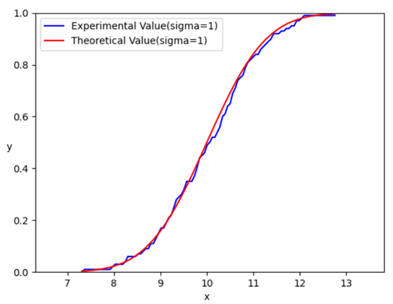
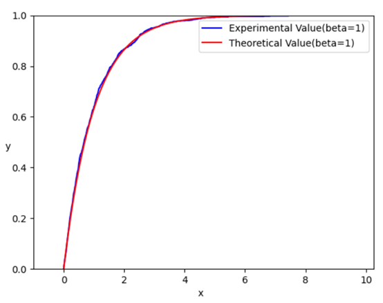
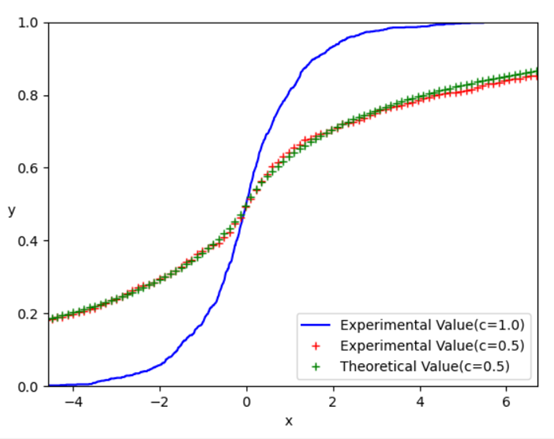

# 伪随机数生成器

实际上是一次课后作业。

程序很简单，个人感觉代码上 `C` 占 50%，`C++` 占 50%。

## 使用方式

直接 `make`，然后到 `bin` 文件夹里面找可执行文件。

可执行文件生成的数据会放在 `data` 中，生成的数据包括：

* 任意给定 **期望、方差、样本点数目** 的高斯分布（lab_1_1_data.txt）；
* 任意给定 **尺度参数、样本点数目** 的指数分布（lab_1_2_data.txt）；
* 任意给定 **期望、方差、样本点数目** 的广义高斯分布（lab_1_3_data1.txt / lab_1_3_data2.txt / lab_1_3_data3.txt）。**（注：形状参数 c = 0.5 或 1.0）**

目前的 `data` 文件夹中已经提供了一份用程序生成好的数据。

在使用 `requirements.txt` 安装后，可以使用 `script` 文件夹中给出的脚本文件绘图。

## 总之

实在是很简单的作业……

对个人来说，意义仅仅在于抄了点 `C++` 代码，简单看了下 `Makefile`。

写代码的时候删了点不该删的东西，导致自己之前使用的 `IDE` 炸了。不过正好因此弥补了一点点因个人懒惰和 `IDE` 带来的知识上的损失。