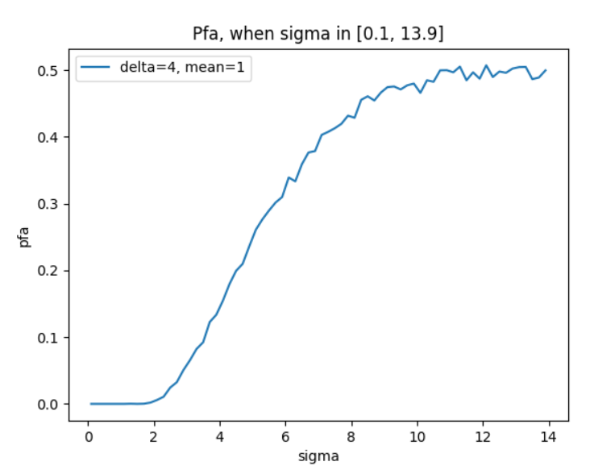

# STDM (扩展变换抖动调制)

这是信息隐藏这学期最后一次作业，其实过程并不轻松。

首先是我之前由于 `BMP` 文件一直没有成功的问题搁置了第二次作业的 `ASS`，我当时自然是以为只差一个 `BMP reader` 和 `BMP writer`，但是没想到 `DCT` 就有问题。

当时没有测试的方法，也没有有关图像嵌入水印和解码的检验，因此什么都是照着课件或者发下来的 `pdf` 搞得。

## 使用方式

直接在该路径下 `make`，然后到 `bin` 文件夹里面执行可执行文件

```bash
> make
> cd bin
> ./main_v0_1_alpha_1.exe
```

之后开始执行程序...

对于这个程序，一共有 6 个选项，与课件中的要求不算是一一对应，但也是多对一的:

```english
(1) test normal STDM;
(2) test STDM with Guass-Voice;
(3) output pfa list, when delta=4,mean=1 (const), sigma variable;
(4) output pfa list, when mean=1,sigma=0 (const), delta variable;
(5) simulate normal JPEG compression;
(6) simulate JPEG compression, when delta=4 (const), q_level variable;
```

这里需要解释一下:

1. 进行简单的 `STDM` 嵌入 / 解码测试;
2. 进行简单的 **带高斯噪声** `STDM` 嵌入 / 解码测试;
3. 固定高斯噪声的均值 `mean` 和量化步长 `delta`，进行单变量 (标准差 `sigma`) 分析;
4. 固定高斯噪声的均值 `mean` 和标准差 `sigma`，进行单变量 (量化步长 `delta`) 分析;
5. 使用程序简单模拟 `jpeg` 压缩;
6. 使用程序进行单变量 (量化等级 `q_level`) 分析，固定量化步长 `delta`。

文件会输出到 `data` 文件夹中，我这里准备好了一份花了比较长时间 (大概一共 10 分钟) 跑出来的数据，放在 `data-reserve` 文件夹里面。不建议动 `data-reserve` 文件夹中的 3 个 `txt` 文件，但是建议可以把文件内容复制粘贴到 `data` 文件夹中的同名文件中。

在准备好了 `data` 文件夹中的数据之后，可以使用 `scripts` 文件夹中的绘图脚本作图，但是需要提前配置环境:

```bash
# ./STDM
> virtualenv .venvs
> ./.venvs/Scripts/activate
>
> pip install -r requirements.txt
> cd scripts
> python lab_3_1_delta.py
> python lab_3_1_sigma.py
> python lab_3_2_qlevel.py
```

之后可以得到如下的结果:



这个我个人觉得是符合期望的。一开始比较平缓，在 0 左右不变，这是因为噪声没有超出当前量化步长(`delta = 4`) 能够压制的范围。但随着 `sigma` 的不断增长，`pfa` 也在不断上升，最终差不多落在 50% 的位置，因为乱猜都可以猜对 50% 的，这已经是一个最差的 `pfa` 了。


这个我也觉得是符合预期的。`delta` 一开始非常小，所以对于 `mean = 4 / sigma = 1` 的噪声起不到很好的压制作用。但是随着量化步长 `delta` 的增大，`pfa` 在稳步下降。而最终下降的结果一定是 0，再加上一开始的错误率落在 50% 左右，我觉得这个数据是没有问题的。


这个图像就有些怪异了，不得不说这和 `q_level` 之于整个 `STDM` 的关系有很大关联。首先要看到 `q_level` 在接近 100 的时候，整个的 `pfa` 是趋向于 0 的，而当 `q_level` 在 20~60 之间的时候，整个错误率基本在 50% 左右徘徊。

比较奇怪的是，`q_level` 在 0 附近时的错误率超过 0.6，基本处于 0.7。另一个比较奇怪的事情是，`q_level` 在接近 100 时错误率又有异常的提高。在这里我分别这样解释它们:

对于 `q_level` 趋近 0，这些都是不可预料的，我只觉得这与计算机的计算精度有关。假设 `q_level = 1`，那么对于如下代码:

```cpp
if (target < 50)
    S = 5000 / target;
else if (target > 50)
    S = 200 - 2*target;
else
    return DCT::Quant_matrix_50;
```

我们可以看到 `S` 的值在 `target` (此处的 `target` 就是 `q_level`) 比较小的时候是呈反比例函数的。**输出的矩阵数值整体偏大, 比较奇怪** 自然是没问题的。

而对于 `q_level` 较大的时候，我们也可以从这个角度理解。假设我们的 `target` 就是 100，那么当前的 `S` 就等于 0。而在 `S` 的计算之后，还有代码:

```cpp
for (double elem : DCT::Quant_matrix_50) {
    size_t input = floor((S*elem + 50) / 100);
    ret.push_back(DCT::round(input));
}
```

这段意味着 `ret` 中所有元素都为 0 (即使我这里是 `static_cast<double>(100)`，那也会因为 `round` 而变为 0)。返回的量化矩阵是 `O`，这意味着 `C` 和 `R` 对矩阵 `D` 的作用应该被抵消，但是这也只是我们理论计算时的想法，实际代码执行的时候根本不会考虑这些。所以图中这种反常的表现只是因为计算机不擅长处理 0 以及无穷大的情况而已。

我还是相信如果 `q_level` 为 100，图像应该是一点影响都不会有的。

## 我觉得

果然第二次做出来了，这个作业就应该好做一些的。

这回完成第三次作业，感觉也是在补第二次作业欠下的旧账。不过还好完成的都差不多。
