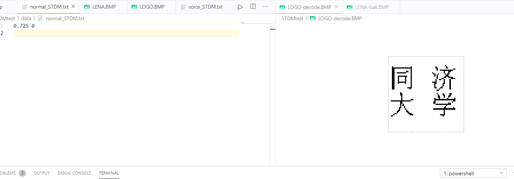
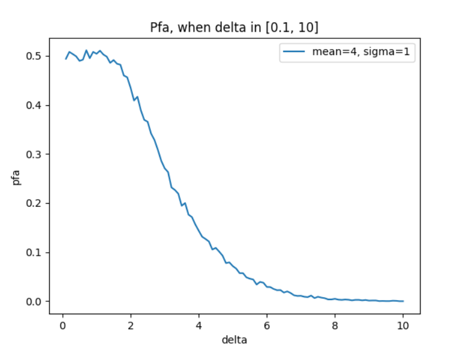

# 实验三

## 一、实验要求

### 1. 水印嵌入和解码

在 `Lena` 图中嵌入一个 64 * 64(共 4096 位)的 `Logo`，需要使用 `STDM` 方法嵌入在 `DCT` 系数中。

### 2. 性能比较-Voice

#### i. 不同噪声强度

在相同的量化步长下，不同强度的噪声攻击下(可以用图像处理软件加入噪声)系统性能的变化曲线。

#### ii. 不同量化步长

画出在相同噪声攻击强度的性能变化曲线

### 3. 性能比较-JPEG

在相同的量化步长下，不同强度的 `JPEG` 压缩(可以用图像处理软件进行压缩)下系统性能的变化的曲线。

## 二、实验背景

### 1. STDM

$$
\begin{matrix}
    s_i = x_i + aw_i \\
    \\
    \\
    s_i w_i = x_i w_i + a \\
    \\
    \\
    \sum_{i=1}^N s_i w_i = \sum_{i=1}^N x_i w_i + Na \\
    \\
    \\
    \dfrac{1}{N} \sum_{i=1}^N s_i w_i = \dfrac{1}{N} \sum_{i=1}^N x_i w_i + a \\
    \\
    \\
    \bar{s} = \bar{x} + a \\
    \\
    \\
    s_i = x_i + (\bar{s} - \bar{x}) w_i
\end{matrix}
$$

具体来说的话 $s_i = x_i + aw_i$ 这个嵌入方式是扩频水印的嵌入方式，但是投影这个手段最后得出的 $q_{\Delta}(x)$ 却是量化水印的公式。

和 `ASS` 相比，这么看的话也就是改了一个公式。

### 2. DCT

其实上次进行了比较详细的描述，在这里就不赘述了。

这里的话，是利用 `DCT` 的解码过程来模拟 `JPEG` 的压缩 / 解压缩带来的图像损失：

```cpp
// DCT_inverse function

/* some code */

if (is_jpeg) {
    // generate C
    assert(D.size() == N*N && Q.size() == N*N);
    for (size_t index = 0; index < N*N; ++index)
        C.push_back(DCT::round(D[index] / Q[index], false));

    // generate R
    for (size_t index = 0; index < N*N; ++index)
        R.push_back(DCT::round(Q[index] * C[index], false));
}
// 如果是 jpeg, 就要考虑中间的 R 矩阵生成
auto X { (is_jpeg) ? R : D };
```

但是我这里的操作也不太好，为之后图像接近 `q_level` 接近 100 产生突变埋下了祸根。

## 三、实验过程

### 1. 不同的嵌入方式

由于我上次并没有很好地实现 `ASS` 的那一个部分。悲观一点来看，我要做的事情肯定比别人多；但是乐观一点的话，我有更大的空间来进行修改，光脚总是不怕穿鞋的。

上次我的编码工作是建立在 `BMP` 读取成功之上的，我的处理是把 512\*512 分成 8\*8 的小块。一共是 64\*64 个 `block`。这毫无疑问增加了代码实现难度（一定程度上），老师一句话一语点醒梦中人 —— “为什么非得切成 8\*8 的小块呢？” 其实 64\*1 的块也是可以的，32\*2 的块也是可以的，只要 `size = 64` 都是可以的。

在这种情况下，我甚至可以使用 `memcpy_s` 函数来快速填入内容，非常的清晰明确：

```cpp
for (size_t bias = 0; bias < STDM::pic_size; bias+=STDM::block_size, ++cnt) {
    double* imbed_inp = new double[STDM::block_size];
    double* imbed_out = new double[STDM::block_size];

    // 使用 memcpy_s 是好的，可以使代码简洁（
    memcpy_s(imbed_inp, block_byte_num, (pic_inp+bias), block_byte_num);
    this->imbed(imbed_inp, imbed_out, logo_inp[cnt], zig_num, q_level, is_jpeg);
    memcpy_s((pic_imbed_out+bias), block_byte_num, imbed_out, block_byte_num);

    delete[] imbed_inp;
    delete[] imbed_out;
}
```

原本需要写两个极其破坏代码美感的循环，现在这样好看多了，而且也不会影响效果。并且解码也是如此：

```cpp
for (size_t bias = 0; bias < STDM::pic_size; bias+=STDM::block_size, ++cnt) {
    double* decode_inp = new double[STDM::block_size];
    memcpy_s(decode_inp, block_byte_num, (pic_imbed_inp+bias), block_byte_num);
    // 返回值为 bool 类型，因此 logo_out 还需要进一步类型转换为 u_char
    logo_out[cnt] = this->decode(decode_inp);
    delete[] decode_inp;
}
```

### 2. 预处理好的 DCT::Quant_matrix_50 等矩阵

确实，计算的代价很恐怖。
我之前是按照 `dct.pdf` 来写的代码，所以为了展现代码的简单易读以及与 `dct.pdf` 中的算法高度一致，我的量化矩阵要计算、`T` 矩阵要计算、`Tp` 矩阵要计算... 这么想来的话，一次 `DCT` 处理 512\*512 的图片：[1]

```cpp
// Quant_matrix_gen function
for (double elem : DCT::Quant_matrix_50) {
    size_t input = floor((S*elem + 50) / 100);
    ret.push_back(DCT::round(input));
}

/* some code */

// T_matrix_gen function
std::vector<std::vector<double>> T;
for (size_t i = 0; i < N; ++i) {
    std::vector<double> T_row;
    for (size_t j = 0; j < N; ++j) {
        if (i == 0)
            T_row.push_back(1.0 / sqrt(N));
        else {
            double theta = ((2*j + 1) * i*M_PI) / (2.0*N);
            T_row.push_back(sqrt(2.0/N) * cos(theta));
        }
    }
    T.push_back(T_row);
}

// transpose
std::vector<double> T_ret, T_tp_ret;
for (size_t i = 0; i < N; ++i)
    for (size_t j = 0; j < N; ++j) {
        T_ret.push_back(T[i][j]);
        T_tp_ret.push_back(T[j][i]);
    }

return { T_ret, T_tp_ret };
```

简单估计一下的话：

$$
\dfrac{512\times512}{8\times8} \times (64 + 64 + 64) = 64 \times 64 \times 64 \times 3
$$

仅仅一次 `DCT` 就需要这么多次取数、写入，这是极其恐怖的。

所以现在做了调整。虽然我写出来的 `DCT` 是支持任意量化步长的，但是说白了再怎么说都是只能支持 64 个数（因为标准量化矩阵的 `size` 是 64），并且我们也知道咱们这个题目有些时候是不需要计算量化矩阵的，直接返回就可以了。所以我加上了这几个全局变量和处理：

```cpp
// Quantitum Matrix: Q_{50}
// using Q_{50} as a standard to generate other Matrix
std::vector<double> DCT::Quant_matrix_50 {
        16, 11, 10, 16, 24, 40, 51, 61,
        12, 12, 14, 19, 26, 58, 60, 55,
        14, 13, 16, 24, 40, 57, 69, 56,
        14, 17, 22, 29, 51, 87, 80, 62,
        18, 22, 37, 56, 68, 109,103,77,
        24, 35, 55, 64, 81, 104,113,92,
        49, 64, 78, 87, 103,121,120,101,
        72, 92, 95, 98, 112,100,103,99
};

std::vector<double> DCT::T_matrix_8x8 {
    0.353553,   0.353553,   0.353553,   0.353553,   0.353553,   0.353553,   0.353553,   0.353553,
    0.490393,   0.415735,   0.277785,   0.0975452,  -0.0975452, -0.277785,  -0.415735,  -0.490393,
    0.46194,    0.191342,   -0.191342,  -0.46194,   -0.46194,   -0.191342,  0.191342,   0.46194,
    0.415735,   -0.0975452, -0.490393,  -0.277785,  0.277785,   0.490393,   0.0975452,  -0.415735,
    0.353553,   -0.353553,  -0.353553,  0.353553,   0.353553,   -0.353553,  -0.353553,  0.353553,
    0.277785,   -0.490393,  0.0975452,  0.415735,   -0.415735,  -0.0975452, 0.490393,   -0.277785,
    0.191342,   -0.46194,   0.46194,    -0.191342,  -0.191342,  0.46194,    -0.46194,   0.191342,
    0.0975452,  -0.277785,  0.415735,   -0.490393,  0.490393,   -0.415735,  0.277785,   -0.0975452
};

std::vector<double> DCT::T_tp_matrix_8x8 {
    0.353553,   0.490393,   0.46194,    0.415735,   0.353553,   0.277785,   0.191342,   0.0975452,
    0.353553,   0.415735,   0.191342,   -0.0975452, -0.353553,  -0.490393,  -0.46194,   -0.277785,
    0.353553,   0.277785,   -0.191342,  -0.490393,  -0.353553,  0.0975452,  0.46194,    0.415735,
    0.353553,   0.0975452,  -0.46194,   -0.277785,  0.353553,   0.415735,   -0.191342,  -0.490393,
    0.353553,   -0.0975452, -0.46194,   0.277785,   0.353553,   -0.415735,  -0.191342,  0.490393,
    0.353553,   -0.277785,  -0.191342,  0.490393,   -0.353553,  -0.0975452, 0.46194,    -0.415735,
    0.353553,   -0.415735,  0.191342,   0.0975452,  -0.353553,  0.490393,   -0.46194,   0.277785,
    0.353553,   -0.490393,  0.46194,    -0.415735,  0.353553,   -0.277785,  0.191342,   -0.0975452
};

/* some code */

// Quant_matrix_gen function
if (target_Q < 50)
    S = 5000 / target_Q;
else if (target_Q > 50)
    S = 200 - 2*target_Q;
else
    // 这里直接返回, 降低计算时间
    return DCT::Quant_matrix_50;

// T_matrix_gen function
if (N == 8)
    // 提前计算好的 T 与 T_tp, 缩短执行时间
    return { DCT::T_matrix_8x8, DCT::T_tp_matrix_8x8 };
```

### 3. 三目运算符代替乘法

其实之前使用乘法是为了和课件上的公式保持一致，这次就完全没有顾及这一点：

```cpp
// 使用三目运算符构成的 +- 法代替乘法, 加快程序执行速度
double x_bar, x_sum = 0;
for (size_t idx = 0; idx < zig_zag_vec.size(); ++idx)
    x_sum += (idx % 2) ? -zig_zag_vec[idx] : zig_zag_vec[idx];
x_bar = x_sum / zig_zag_vec.size();
```

在求投影的时候，我这里就是使用了三目运算符来代替 $\times w_i$。
但我这里有一个疑问，按道理说这个乘法会执行很多次，但是改成三目运算符之后却没有提高很多性能。这么想的话，我个人觉得编译器很有可能已经做过了一次优化，把我的乘 ±1 简化成了加减法。

## 四、实验结果

### 1. 水印嵌入和解码-solution

水印嵌入基本上是人肉眼不可分辨的：


看起来一样，但实际上它们是有区别的。我用二进制编辑器打开，就会发现某些位的确发生了某些不是很显著的改变：


但需要说明的是，即使是相同的宿主图像、相同的水印、相同的强度步长，在进行 `imbed` 操作之后得到的图像是不一定相同的。这是因为不同嵌入操作 **选取的块** 不同。有的同学选择 8\*8，而我选择的是 64\*1，这样看起来就完全不一样。

同时我们可以看到解码过后的效果：


在 `delta = 4` 的情况下，可以做到完全还原，此时错误率为 0。但其实在 `delta = 0.8` 左右的时候，就已经可以完全还原没有噪声攻击的嵌入图像了。

### 2.性能比较-Voice-solution

在这里就不特别着重展示水印解码效果，而是强调图像的分析了。

#### i. 不同噪声强度-solution

首先要求相同步长，文件夹里面的样例数据是 `delta = 4`：


这是添加 `sigma = 2` 的高斯噪声的结果，可以看到已经有一些小黑点了。


这是添加 `sigma = 4` 的高斯噪声的结果，现在只能看到四个模糊的边框了。


现在的 `sigma = 6`，只有知道嵌入的是什么才能猜到内容了。


现在 `sigma = 8`，我说我做了个 `QR-code` 生成器都能有人相信。

可以看到，在误检率为 33% 的时候，人类就已经很难看出水印到底嵌入的是什么了。要说轮廓那还是有，但已经很不明显了。

这是相关的曲线图：


这个我个人觉得是符合期望的。一开始比较平缓，在 0 左右不变，这是因为噪声没有超出当前量化步长(`delta = 4`) 能够压制的范围。但随着 `sigma` 的不断增长，`pfa` 也在不断上升，最终差不多落在 50% 的位置，因为乱猜都可以猜对 50% 的，这已经是一个最差的 `pfa` 了。

#### ii. 不同量化步长-solution

我也考虑了不同的量化步长。在这里，我保持 `mean = 0, sigma = 0` 不变，以下是一些解码效果：


此时 `delta = 0.4`，可以看出 `delta` 在小于 0.4 的时候，对扩频水印嵌入方式根本没有做到压制效果。


在这个 0.1 的范围内，错误率显著降低。`Logo` 中的字样已经初现雏形。


这里直接跳到后面误差比较小的 `delta`，表面上只有一些小黑点了。



而经过我的一些调整之后，我发现大概在 `delta = 0.725` 的时候，`pfa` 第一次达到 0。这个数值远远小于课件中给出的 `delta = 4`，这样看来的话，课件中的标准已经是大大降低了。我想，即使是中间出了一点点小问题，这个容错范围也还是可以包含进去。



这是 `data` 文件夹中给出的样本数据，我是以 `mean = 4, sigma = 1` 测试的。（其实我觉得 `mean` 几乎不会造成影响，只有 `sigma` 会造成影响）

这个我也觉得是符合预期的。`delta` 一开始非常小，所以对于 `mean = 4 / sigma = 1` 的噪声起不到很好的压制作用。但是随着量化步长 `delta` 的增大，`pfa` 在稳步下降。而最终下降的结果一定是 0，再加上一开始的错误率落在 50% 左右，我觉得这个数据是没有问题的。

### 3. 性能比较-JPEG-solution

`JPEG` 压缩率怎么计算我不清楚，我这里就暂且使用与之反相关的 `q_level` 作为指标：


`q_level` 越低，图像损失得就越多，解码效果自然也就越差。


可以看出 `q_level` 带来的变化非常恐怖，即使 `q_level = 90`，解码出来得到的水印也还是会有很明显的误判。


这里的 `q_level = 97`，才达到一个比较理想的解码效果。这里需要说明的是，上面四张图进行实验，`delta = 4`，由于 `delta` 取值并不是特别大，所以看起来效果不是很好。


这个我个人觉得是符合期望的。一开始比较平缓，在 0 左右不变，这是因为噪声没有超出当前量化步长(`delta = 4`) 能够压制的范围。但随着 `sigma` 的不断增长，`pfa` 也在不断上升，最终差不多落在 50% 的位置，因为乱猜都可以猜对 50% 的，这已经是一个最差的 `pfa` 了。


这个我也觉得是符合预期的。`delta` 一开始非常小，所以对于 `mean = 4 / sigma = 1` 的噪声起不到很好的压制作用。但是随着量化步长 `delta` 的增大，`pfa` 在稳步下降。而最终下降的结果一定是 0，再加上一开始的错误率落在 50% 左右，我觉得这个数据是没有问题的。


这个图像就有些怪异了，不得不说这和 `q_level` 之于整个 `STDM` 的关系有很大关联。首先要看到 `q_level` 在接近 100 的时候，整个的 `pfa` 是趋向于 0 的，而当 `q_level` 在 20~60 之间的时候，整个错误率基本在 50% 左右徘徊。

比较奇怪的是，`q_level` 在 0 附近时的错误率超过 0.6，基本处于 0.7。另一个比较奇怪的事情是，`q_level` 在接近 100 时错误率又有异常的提高。在这里我分别这样解释它们:

对于 `q_level` 趋近 0，这些都是不可预料的，我只觉得这与计算机的计算精度有关。假设 `q_level = 1`，那么对于如下代码:

```cpp
if (target < 50)
    S = 5000 / target;
else if (target > 50)
    S = 200 - 2*target;
else
    return DCT::Quant_matrix_50;
```

我们可以看到 `S` 的值在 `target` (此处的 `target` 就是 `q_level`) 比较小的时候是呈反比例函数的。**输出的矩阵数值整体偏大, 比较奇怪** 自然是没问题的。

而对于 `q_level` 较大的时候，我们也可以从这个角度理解。假设我们的 `target` 就是 100，那么当前的 `S` 就等于 0。而在 `S` 的计算之后，还有代码:

```cpp
for (double elem : DCT::Quant_matrix_50) {
    size_t input = floor((S*elem + 50) / 100);
    ret.push_back(DCT::round(input));
}
```

这段意味着 `ret` 中所有元素都为 0 (即使我这里是 `static_cast<double>(100)`，那也会因为 `round` 而变为 0)。返回的量化矩阵是 `O`，这意味着 `C` 和 `R` 对矩阵 `D` 的作用应该被抵消，但是这也只是我们理论计算时的想法，实际代码执行的时候根本不会考虑这些。所以图中这种反常的表现只是因为计算机不擅长处理 0 以及无穷大的情况而已。

我还是相信如果 `q_level` 为 100，图像应该是一点影响都不会有的。

## 五、参考 / 引用

[1] quantization-matrix-in-jpeg-compression: https://stackoverflow.com/questions/29215879/how-can-i-generalize-the-quantization-matrix-in-jpeg-compression
