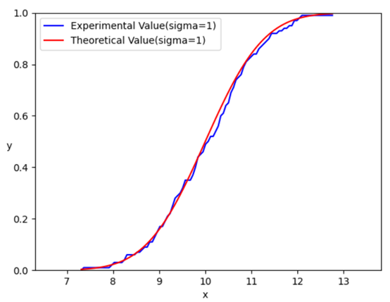
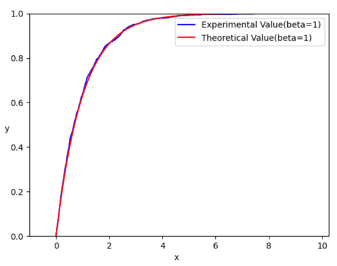
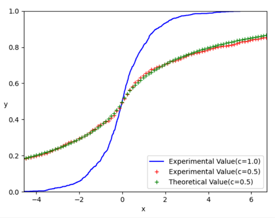

# 实验一 伪随机数发生器

## 一、实验要求

### 1. 高斯分布

* 使用 `Box-Muller` 方法，产生符合高斯分布 $N(\mu, \delta^2)$ 的随机数；
* 使用参数估计法估计相应的 $\mu, \sigma$；
* 实验比较理论 `CDF` 和实际 `CDF`。

### 2. 指数分布

* 使用逆函数法产生尺度参数为 $\beta$ 的指数分布；
* 估计参数的取值；
* 推到 $\beta$ 的最大似然估计率参数估计法；
* 实验比较理论 `CDF` 和实际 `CDF`。

### 3. 广义高斯分布

* 生成形状参数 `c = 1.0 ` 和 `c = 0.5` 下广义高斯分布的随机数；
* 使用矩估计法估计形状参数；
* 实验比较理论 `CDF` 和实际 `CDF`。

### 4. 通用要求

* 编程语言使用 `C++ / C`，不能使用脚本语言（画图时除外）；
* 代码简洁、逻辑清晰、运行正确、留有注释。


## 二、实验背景

### 1. Box-Muller

**Box-Muller** 其实不是一个算法，而是一种方法，是生成任意随机分布的通用办法。

我本人是难以揣摩 **Box-Muller** 方法真正内涵的，能够掌握的也仅仅是利用均匀分布来生成正态分布。
$$
X = cos(2\pi U_1) \sqrt{-2 \ln{U_2}} \\
Y = sin(2\pi U_1) \sqrt{-2 \ln{U_2}}  
$$
其中，$X$ 和 $Y$ 均服从 $N(0, 1)$，仅要 $U_1, U_2$ 都是在 `[0,1]` 区间上的均匀分布。特别需要注意的是， $U_1, U_2$ 是不同的均匀分布。使用伪随机数生成器的时候也特别需要注意这一点。[1]

由于一开始没有使用不同的随机数生成器，我们的代码是这样的：

```c++
double GuassDstrb_single_val(
    double miu,
    double sigma
) {
    double u_1 = U_1(rng);
    assert(u_1 <= 1 && u_1 > 0);
    double R = sqrt(-2.0 * log(u_1));
    double z_0 = R * cos(twi_pi * u_1);
    return miu + sigma * z_0;
}
```

可以看到，生成了一个同时作用于 `log` 以及 `cos` 中的随机数。在 **Box-Muller** 方法中，`sqrt(-2 * log(u))` 又被称为 `R`，是极坐标变换中的参量。而这个和后面的随机数与角度 `theta` 有关。

二者如果来源于同一随机数生成器，那么也就代表着极径与角度具有关联。

但是假设这样的两个密度函数：
$$
p(X) = \dfrac{1}{\sqrt{2\pi}} \exp(-\dfrac{X^2}{2}) \\
p(Y) = \dfrac{1}{\sqrt{2\pi}} \exp(-\dfrac{Y^2}{2})
$$
由于 $X, Y$ 独立，那么其联合概率函数为：
$$
p(X, Y) = \dfrac{1}{2\pi} \exp(-\dfrac{X^2 + Y^2}{2})
$$
极坐标变换：
$$
X = Rcos\theta 
\\
Y = Rsin\theta
$$
有：
$$
P_R(R \le r) = \int_0^{2\pi} \int_0^r \dfrac{1}{2\pi} \exp(-\dfrac{R^2}{2}) Rd\theta dR = 1 - \exp(-\dfrac{r^2}{2}) 
$$
其反函数为：
$$
R = F_R^{-1}(z) = \sqrt{-2 \ln(1-z)}
$$
上课也讲过的，这里需要换一个限，之后就可以得到课上讲的了。

正是因为一开始没有注意到这一点，因此得出了错误的图像。


### 2. Incompatible Gamma Function

普通的 **Gamma** 函数是不复杂的，其满足 $\Gamma(z+1) = z \Gamma(z)$。

但是对于非完整的 **Gamma** 函数，数学推导比较复杂，这里就不誊写了。所有的程序都参考 《Numerical Recipes in C》这本书。[2]

可是本题并不仅仅是求一个 **Incompatible Gamma Function**，还要在此基础之上，进一步得出广义高斯分布的分布函数。

我们已知：
$$
F_{Gamma(\alpha, \beta)}(x) = \dfrac{1}{\Gamma(\alpha) \beta^\alpha} \int_0^x t^{\alpha - 1} \exp(-t / \beta) dt \\ = \dfrac{1}{\Gamma(\alpha)} \int_0^{x / \beta} t^{\alpha - 1} \exp(-t) dt
$$
对于广义高斯分布，其理论值如下：
$$
F_X(x) =\begin{cases}0.5 F_{Gamma(\frac{1}{c}, \frac{1}{\beta^c})}(x^c) + 0.5, \quad if\ x \ge 0 \\\\0.5 [1-F_{Gamma(\frac{1}{c}, \frac{1}{\beta^c})}((-x)^c)], \quad if\ x < 0 \\\end{cases}
$$

那么对于 $F_{Gamma(\frac{1}{c}, \frac{1}{\beta^c})}$，其公式推导过程如下：
$$
= \dfrac{1}{\Gamma(\alpha)} \beta^{c \frac{1}{c}} \int_0^x t^{\frac{1}{c} - 1} \exp(-t \beta^c) dt \\
= \dfrac{1}{\Gamma(\alpha) \beta^{c-1}} \int_0^{\beta^c x} \dfrac{k^{\frac{1}{c}}}{\beta} \dfrac{\beta^c}{k} \exp(k) dk \\
= \int_0^{\beta^c x} k^{\frac{1}{c}x} k^{\frac{1}{c}-1} \exp(k) dk = \int_0^{\beta^c x} t^{\frac{1}{c} - 1} \exp(t) dt
$$
于是可以将该式带入上方的广义高斯分布，组合得到程序代码。


## 三、实验过程

### 1. 均匀分布类

C++ 中的 `random` 库中有 `uniform_real_distribution, uniform_int_distribution` 两个类。

```english
This distribution (also know as rectangular distribution) produces random numbers in a range [a,b) where all intervals of the same length within it are equally probable.

The distribution parameters, a and b, are set on construction.[3]
```

该分布类需要 `random_device, default_random_engine` 两个类的对象激活：

```c++
std::uniform_real_distribution<double> U_1 {0,1};
std::random_device rd;
std::default_random_engine rng {rd()};

/* some important code */
{
    double u_1 = U_1(rng);
}
```


### 2. 高斯分布生成及其检验

利用 **Box-Muller** 方法可以通过均匀分布得到高斯分布：

```c++
double u_1 = U_1(rng), u_2 = U_2(rng);
assert(u_2 <= 1 && u_2 > 0);
double R = sqrt(-2.0 * log(u_2));
double z_0 = R * cos(twi_pi * u_1);
return miu + sigma * z_0;
```

相应的参数估计方法为：
$$
\mu = E(X) = \dfrac{X_1 + X_2 + ... + X_N}{N} = Y_1 \\
\mu^2 + \delta^2 = E(x^2) = \dfrac{X_1^2 + X_2^2 + ... + X_N^2}{N} = Y_2
$$
对应代码为：

```c++
double miu, sigma;
double sum_x_i = 0, square_sum_x_i = 0;
for (double x_i : arr) {
    sum_x_i += x_i;
    square_sum_x_i += pow(x_i, 2);
}
miu = sum_x_i / arr.size();
double miu_and_sigma_square = square_sum_x_i / arr.size();
sigma = sqrt(miu_and_sigma_square - pow(miu, 2));
```

$$
\dfrac{\part L}{\part \mu} = \sum_{i=1}^{N} \dfrac{X_i - \mu}{\sigma^2} = 0 \\
\dfrac{\part L}{\part \sigma} = -\dfrac{N}{\sigma} + \sum_{i=1}^{N} \dfrac{(X_i - \mu)^2}{\sigma^3} = 0
$$

$\mu, \sigma$ 的最大似然估计值分别为：
$$
\mu = \dfrac{\sum_{i=1}^{N} X_i}{N} \\
\sigma = \sqrt{\dfrac{\sum_{i=1}^{N}(X_i - \mu)^2}{N}}
$$
对应的极大似然估计法的代码为：[4]

```c++
double miu, sigma;
double sum_x_i = 0;
for (double x_i : arr)
    sum_x_i += x_i;
miu = sum_x_i / arr.size();

double square_sum_x_i_minus_miu = 0;
for (double x_i : arr)
    square_sum_x_i_minus_miu += pow(x_i - miu, 2);
sigma = sqrt(square_sum_x_i_minus_miu / arr.size());
```


### 3. 指数分布生成及其检验

对于指数分布，要求使用逆函数法直接求解，推导过程就不再重述了，课件里面有。

这里直接给出我们的代码：

```c++
double u = U_1(rng);
return (-beta) * log(1-u);
```

指数分布的 **极大似然参数估计** 是本题的第三问：
$$
L(\beta) = ln \prod_{i=1}^n (\dfrac{1}{\beta} e^{-x_i/\beta}) = nln\dfrac{1}{\beta} -\dfrac{1}{\beta} \sum_{i=1}^n x_i
$$

$$
\dfrac{dL}{d\beta} = -n \dfrac{1}{\beta} + \dfrac{1}{\beta^2} \sum_{i=1}^{n} x_i = 0
$$

$$
\beta = \dfrac{\sum_{i=1}^{n} x_i}{n}
$$

由此可以推出 $\beta$ 的估计值，对应的代码如下：

```c++
for (double x_i : arr)
    sum += x_i;
return sum / arr.size();
```


### 4. 广义高斯分布生成及其检验

广义高斯分布生成需要 0 / 1 分布以及 `Gamma` 分布的辅助：
$$
X =
\begin{cases}
E^{1/c}, \quad if\ W = 1; \\
\\
-E^{1/c}, \quad if\ W = 0.
\end{cases}
$$
其分布为：
$$
F_X(x) =
\begin{cases}
0.5 P(E \le x^c) + 0.5, \quad if\ x \ge 0, \\
\\
0.5 P(E > (-x)^c), \quad if\ x < 0.
\end{cases}
$$
对应的代码如下：

```c++
std::vector<double> arr;
for (size_t index = 0; index < size; ++index) {
    size_t Bnl_res = BnlDstrb_single_val();
    double E = pow(G(rng),1/c);
    if (Bnl_res == 1)
        arr.push_back(E);
    else
        arr.push_back(-E);
}
return arr;
```

对于 `gamma` 函数，我们通过《Numerical Recipes in C》中的代码得到：

```c++
if (x < alpha + 1.0) {
    std::pair<double, double> res {gser(alpha, x)};
    return res.first;
}
else {
    std::pair<double, double> res {gcf(alpha, x)};
    return 1.0 - res.first;
}
```

对于可选题，我们使用课件中的矩估计法来进行形状参数估计，这个参数估计是比较特殊的，其需要给定一个区间，并在那个区间内寻找合适的 c。

在我们的程序中，需要手动给出一个区间，如果这个区间中并不存在合适的 c，程序会提醒继续输入，直到找到 c 的合适区间，并估计出 c 的值为止：

```c++
do {
    double a, b, stride;
    std::cout << "note: you must figure out c's scope with [a, b]:"
        <<  "      (double, recommand int)" << std::endl;
    std::cin >> a >> b;
    std::cout << "      you must figure out stride:"
        << "(double, recommand [.001, 1], default .01)" << std::endl;
    std::cin >> stride;
    c = Gamma_inverse_solve(
        E_abs_x / sigma,
        a, b, stride
    );
    flag = (c == a || c == b);
} while(flag);
return c;
```


## 四、输出数据和图像

### 1. 高斯分布

生成了 `data/lab_1_1_data.txt`，并使用 `scripts/plot1_1.py` 进行作图：



### 2. 指数分布

生成了 `data/lab_1_2_data.txt`，并使用 `scripts/plot1_2.py` 进行作图：



### 3. 广义高斯分布

* 生成了 `data/lab_1_3_data1.txt` 作为 `c = 1.0` 下的实验坐标值；
* 生成了 `data/lab_1_3_data2.txt` 作为 `c = 0.5` 下的实验坐标值；
* 生成了 `data/lab_1_3_data3.txt` 作为 `c = 0.5` 下的理论坐标值。

最后使用 `scripts/plot1_3.py` 进行作图：




## 五、参考 / 引用

[1] Box-Muller-transform: https://en.wikipedia.org/wiki/Box%E2%80%93Muller_transform

[2] Numerical-Recipes-in-C

[3] cplusplus-reference: http://www.cplusplus.com/reference/random/uniform_real_distribution/

[4] Maximum-Likelihood-Estimation(MLE): https://zh.m.wikipedia.org/wiki/%E6%9C%80%E5%A4%A7%E4%BC%BC%E7%84%B6%E4%BC%B0%E8%AE%A1